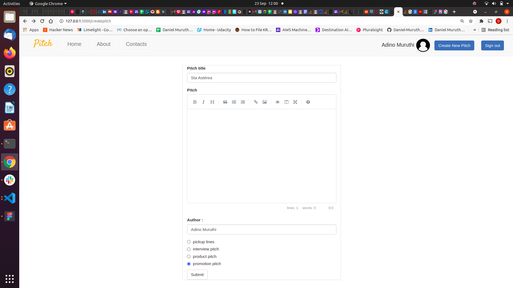

## Pitcher_App

### Pitch is a website platform that gives you the opportunity to create pitches of different categories e.g., promotion pitches and read pitches from other existing users as well. To join the Pitch community

#### By **Daniel Muthama**

## Description

Its a Flask web application that enables users to create categorized pitches, view pitches from other users and upvote and downvote on those pitches

## Creating a Pitch

## Setup/Installation Requirements

- Visual Studio Code
- Linux Terminal
- Github
- Heroku
- Flask virtual Environment
- postgresql

### Known Bugs

None observed so far

### Technologies Used

This project has been written using html, css, python languages and flask frameworks and postgresql

### installations

Create a virtual environment and proceed to add the dependancies

- python3 -m venv --without-pip virtual
- curl https://bootstrap.pypa.io/get-pip.py | python
- source virtual/bin/activate
- pip install flask
- pip install flask-bootstrap
- pip install flask-script
- python3 -m  pip install gunicorn
- install Heroku cli
- install postgresql

#### Support and contact details

EMAIL: danielmuthama23@gmail.com

